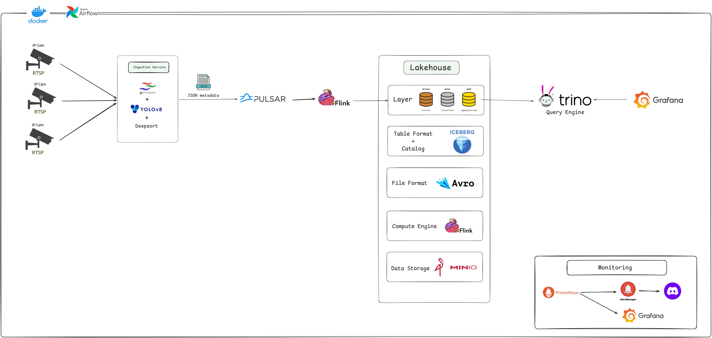

# Retail Video Analytics (Lakehouse, Realtime)

> Realtime pipeline thu thập & xử lý **metadata video** cho chuỗi bán lẻ.
> Stack: **GStreamer + YOLOv8 + DeepSort → Pulsar → Flink → Iceberg on MinIO → Trino → Grafana**
> Orchestration (optional): **Airflow** cho maintenance/batch.

 

## 📦 Thành phần chính

  * **Ingestion Service**: `gstreamer + yolo v8 + deepsort` → phát hiện & tracking, xuất **JSON metadata** (không đẩy khung hình).
  * **Transport**: **Apache Pulsar** (`Key_Shared` theo `camera_id`, schema Avro/JSON).
  * **Stream Compute**: **Apache Flink** (để xử lý, làm sạch, và ghi dữ liệu).
  * **Lakehouse**: **Apache Iceberg** (table format) + **REST Catalog** trên **MinIO** (kho lưu trữ).
  * **Query**: **Trino** (Iceberg connector).
  * **Visualization**: **Grafana** (BI near-real-time qua Trino).
  * **(Optional) Orchestration**: **Airflow** (chạy các tác vụ bảo trì, dọn dẹp Iceberg).

-----

## ⚙️ Yêu cầu & Cài đặt

  * Docker & Docker Compose
  * (Tùy chọn) GPU cho YOLOv8

### 1\. Chuẩn bị Biến môi trường

Copy tệp `.env.example` thành `.env` và điền các thông tin credentials (ví dụ: `MINIO_ROOT_USER`, `MINIO_ROOT_PASSWORD`).

```bash
cp .env.example .env
# Mở file .env và chỉnh sửa
```

### 2\. Xây dựng (Build) và Khởi chạy

Các image Flink và Airflow tùy chỉnh (nếu có) sẽ được tự động build.

```bash
# Khởi động toàn bộ hạ tầng ở chế độ nền (detached)
docker compose up -d
```

### 3\. Cổng dịch vụ (Default Ports)

  * **Trino**: `8080`
  * **Flink UI**: `8081`
  * **Pulsar Admin**: `8082`
  * **Airflow UI**: `8088`
  * **MinIO API**: `9000`
  * **MinIO Console**: `9001`
  * **Iceberg REST**: `8181`
  * **Grafana**: `3000`
  * **Pulsar Broker**: `6650`

**Lưu ý Pulsar (Docker Desktop):** broker dùng dual-listener.  
  * Nội bộ docker: `pulsar://pulsar-broker:6650` (listenerName=`internal`).  
  * Host/Windows: `pulsar://127.0.0.1:6650` (listenerName=`external`).

-----

## 📚 Tài liệu chi tiết

  * 📄 **Project Doc (Google Drive)**: [Tài liệu Retail Video Analytics](https://drive.google.com/drive/folders/15HIuR8GIeGHsRPt7F2PeaChrG9XlMYoa?usp=sharing)
  * 📄 **Hướng dẫn chạy (Local)**: Xem `docs/guide.md`
  * 📄 **Luồng dữ liệu E2E**: Xem `docs/data-flow-guide.md`
  * 🥈 **Silver (Bronze → Silver)**: SQL ở `flink-jobs/sql/*`; quick-start bên dưới
  * 🥇 **Gold (BI Views qua Trino)**: `flink-jobs/sql/gold_views.sql`

### Silver quick-start

Chạy theo thứ tự để dựng bảng Silver `rva.silver_detections` từ Bronze `rva.bronze_raw`:

```bash
# 1) Setup Flink SQL session + Iceberg catalog
docker exec -it flink-jobmanager bash -lc \
  "/opt/flink/bin/sql-client.sh -f /opt/flink/usrlib/sql/silver_setup.sql"

# 2) Tạo bảng Silver (chạy một lần)
docker exec -it flink-jobmanager bash -lc \
  "/opt/flink/bin/sql-client.sh -f /opt/flink/usrlib/sql/silver_create_table.sql"

# 3) Streaming INSERT từ Bronze sang Silver
docker exec -it flink-jobmanager bash -lc \
  "/opt/flink/bin/sql-client.sh -f /opt/flink/usrlib/sql/silver_insert.sql"

# Kiểm tra dữ liệu sinh ra trong MinIO
docker exec minio mc ls -r local/warehouse/rva/silver_detections/data/
```

### Gold quick-start (Trino Views)

Tạo các view Gold phục vụ Grafana/BI trực tiếp trên Trino:

```bash
# Copy file SQL vào container Trino rồi thực thi
docker cp flink-jobs/sql/gold_views.sql trino:/tmp/gold_views.sql
docker exec -it trino trino --file /tmp/gold_views.sql

# Kiểm tra các view đã tạo
docker exec -it trino trino --execute "SHOW TABLES FROM lakehouse.rva"

# Truy vấn nhanh
docker exec -it trino trino --execute "SELECT * FROM lakehouse.rva.v_gold_minute_by_cam ORDER BY ts_minute DESC LIMIT 20"
```

-----

## 👥 Contributors

  * [Nguyễn Tấn Hùng](https://github.com/hungfnguyen)
  * [Nguyễn Công Đôn](https://github.com/CongDon1207)
