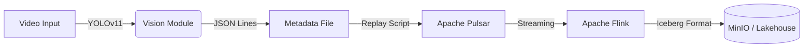

# Luồng Dữ Liệu (Data Flow) - Retail Video Analytics

Tài liệu này mô tả chi tiết hành trình của dữ liệu từ video gốc cho đến khi được lưu trữ vào Data Lakehouse.

## Sơ Đồ Tổng Quan



---

## Chi Tiết Từng Bước

### 1. Trích Xuất Metadata (Vision Layer)

Quá trình bắt đầu từ module Computer Vision xử lý video đầu vào.

*   **Input**: File video (ví dụ: `.mp4`, `.avi`) hoặc luồng Camera (RTSP).
*   **Xử lý**:
    *   Sử dụng mô hình **YOLO11** để phát hiện đối tượng (Object Detection) trên từng khung hình (frame).
    *   Trích xuất thông tin: Tọa độ (Bounding Box), Loại đối tượng (Class), Độ tin cậy (Confidence), và ID theo dõi (Tracking ID - nếu có).
*   **Output**: Dữ liệu được ghi ra file cục bộ dưới dạng **JSON Lines (`.jsonl`)**. Mỗi dòng là metadata của một frame.

**Ví dụ mẫu dữ liệu (1 dòng JSON):**
```json
{
  "frame_id": 105,
  "timestamp": "2025-10-06T10:00:05.123Z",
  "source": {
    "video_path": "/data/videos/cam_01.mp4",
    "fps": 30
  },
  "detections": [
    {
      "class_id": 0,
      "label": "person",
      "confidence": 0.88,
      "bbox": [100, 200, 150, 350],
      "track_id": 12
    },
    {
      "class_id": 39,
      "label": "bottle",
      "confidence": 0.92,
      "bbox": [300, 400, 320, 450],
      "track_id": -1
    }
  ]
}
```

### 2. Ingestion (Messaging Layer)

Dữ liệu metadata từ file được đẩy vào hệ thống hàng đợi để xử lý bất đồng bộ và chịu tải cao.

*   **Công cụ**: Script `scripts/replay_jsonl_to_pulsar.py`.
*   **Cơ chế**: Đọc tuần tự từng dòng từ file `.jsonl` và gửi (produce) message.
*   **Hệ thống**: **Apache Pulsar**.
*   **Topic đích**: `persistent://retail/metadata/events`.
*   **Dạng Message**: Raw String (JSON).

### 3. Xử Lý Dòng (Streaming Processing Layer)

Apache Flink đóng vai trò là bộ máy xử lý trung tâm, tiêu thụ dữ liệu từ Pulsar và ghi xuống Lakehouse.

*   **Công cụ**: **Apache Flink** (chạy Flink SQL).
*   **Job**: `flink-jobs/bronze_ingest.sql`.
*   **Quy trình**:
    1.  **Source Table**: Kết nối tới Pulsar topic `retail/metadata/events` sử dụng Pulsar Connector. Đọc dữ liệu từ vị trí sớm nhất (`earliest`).
    2.  **Sink Table**: Kết nối tới Iceberg Catalog.
    3.  **Transformation**: Chuyển đổi đơn giản (ánh xạ 1-1) để đưa dữ liệu thô vào tầng Bronze.

### 4. Lưu Trữ (Lakehouse Storage Layer)

Dữ liệu cuối cùng nằm yên tại hệ thống lưu trữ phân tán, sẵn sàng cho các truy vấn phân tích.

*   **Công nghệ**: **Apache Iceberg** (Table Format) trên nền **MinIO** (Object Storage).
*   **Cấu trúc**:
    *   **Catalog**: REST Catalog.
    *   **Namespace**: `retail`.
    *   **Table**: `bronze_detections`.
*   **Định dạng file vật lý**: Parquet (được nén và tối ưu cho Analytics).
*   **Phân lớp dữ liệu (Medallion Architecture)**:
    *   Hiện tại dữ liệu đang ở lớp **Bronze** (Raw Data - Dữ liệu thô, giữ nguyên bản gốc từ nguồn).
    *   Các bước tiếp theo (chưa triển khai) sẽ xử lý từ Bronze -> **Silver** (Làm sạch, tách cột) -> **Gold** (Aggregate, báo cáo).
